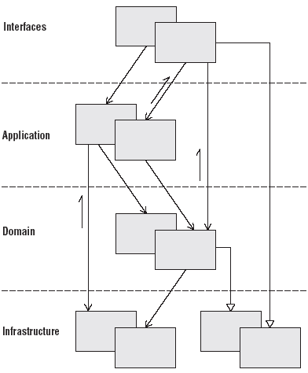
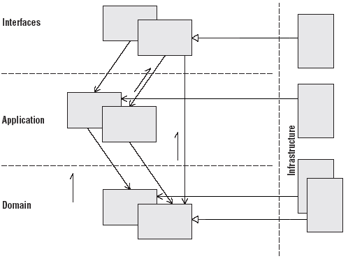
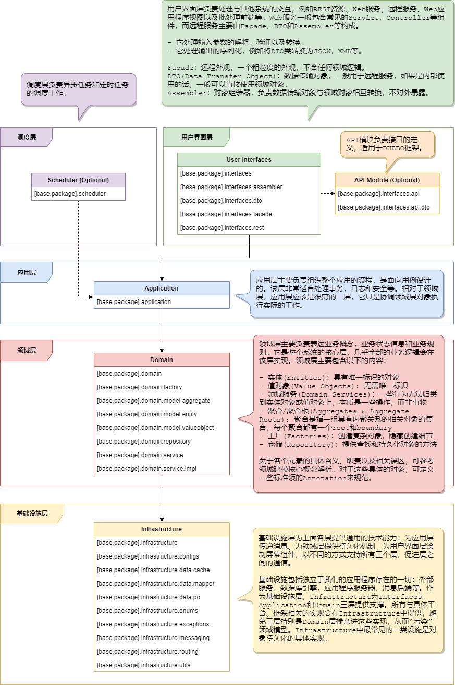

# muyie-ddd

**领域驱动设计是一种思想，而不是具体的框架。**

我们知道软件的产生过程包括：分析、设计、编程、测试、部署等。过去，分析领域和软件设计是分裂的，分析人员从领域中收集基本概念；而设计必须指明一组能在项目中适应编程工具构造的组件，这些组件必须能够在目标环境中有效执行，并能够正确解决应用程序出现的问题。模型驱动设计（Model-Driven Design）抛弃了分裂分析模型与设计的做法，而领域驱动设计（Domain-Driven Design, DDD）就是用来满足这两方面要求的。

## 分层架构

分层架构是一种经典的软件体系结构，例如经典的三层架构：**展示层 -> 业务逻辑层 -> 数据访问层**。严格的分层架构仅允许上层直接访问下层，但我们建议使用宽松的分层构架，该体系结构允许任何更高的层访问其他任何层。

在领域驱动设计中，推荐使用四层架构模型，如下图所示：

所有上层都依赖基础设施层提供的技术能力，强耦合显示是不可取的。我们将基础设施层移到了一侧，这样，能更好地理解用户界面层、应用层、领域层与基础设施层的依赖关系。

理解了领域驱动模型中的分层架构，我们总结了一套较为可行的分层结构图如下：

## 资料

- [什么是域驱动设计？](http://seedstack.org/docs/business/)
- [DDD中分层架构](https://my.oschina.net/hosee/blog/919426)
- [DDD 极简教程](https://www.jianshu.com/p/b0379067c978)
- [DDD分层架构的三种模式](https://www.jianshu.com/p/a775836c7e25?from=groupmessage)
- [领域驱动设计DDD和CQRS落地](https://www.jianshu.com/p/Tozpp3)
- [架构系列：逻辑分层演示](https://www.cnblogs.com/easygame/p/4341856.html)